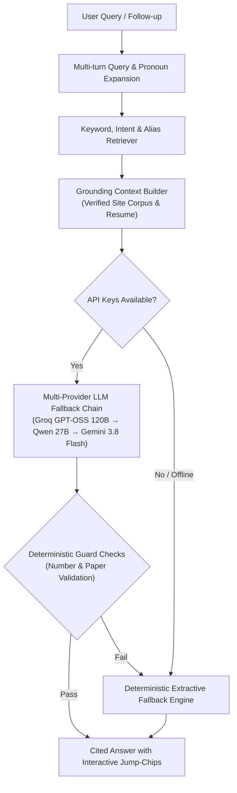

<div align="center">

# ⚡ Balamurugan P G — Portfolio & Grounded AI Assistant

**An engineering-first portfolio featuring verified ML systems, ongoing reinforcement learning research, and an interactive zero-hallucination assistant.**

[](https://nextjs.org/)
[](https://react.dev/)
[](https://www.typescriptlang.org/)
[](https://tailwindcss.com/)
[](https://www.framer.com/motion/)
[](https://pypi.org/project/verascan/)
[](https://playwright.dev/)
[](LICENSE)

[🌐 **Live Website**](https://balamuruganpg.in) · [📄 **Resume (PDF)**](https://balamuruganpg.in/BalamuruganPG_Resume.pdf) · [💼 **LinkedIn**](https://www.linkedin.com/in/balamuruganpg) · [🐙 **GitHub**](https://github.com/balamuruganpg) · [🧩 **LeetCode**](https://leetcode.com/u/balamuruganpg)

</div>

---

## 🧭 Overview

This repository powers **[balamuruganpg.in](https://balamuruganpg.in)** — built from scratch to showcase machine learning systems with concrete, reproducible receipts instead of inflated claims. 

It catalogues **15 projects** (including ongoing sim-to-real RL research, published PyPI packages, and live computer vision apps) alongside an **in-browser AI assistant** strictly grounded to verified site facts.

---

## ✨ Key Features

### 🤖 Grounded AI Assistant Architecture
An integrated assistant designed with zero-tolerance hallucination boundaries:
- **Dual-Mode Retrieval**: Fast keyword, alias, and intent-weighted scoring over verified site corpus (`src/data/site.ts`) and resume markdown (`content/resume.md`).
- **Multi-Provider Fallback Chain**: Orchestrates queries across **Groq** (`openai/gpt-oss-120b`, `openai/gpt-oss-20b`, `qwen/qwen3.8-27b`) and **Google Gemini** (`gemini-3.8-flash`), with automatic token failover.
- **Deterministic Hallucination Guards**: Regex verification that scans every generated token against context facts. If the LLM invents ungrounded numbers, metrics, or publication claims, it is automatically intercepted and superseded by a deterministic extractive answer.
- **Interactive Citation Chips**: Every assistant answer generates clickable citation tags (`[VeraScan ↗]`, `[RAI-Axiom ↗]`) that smoothly scroll to and trigger visual spotlights on the matching card.
- **Pronoun & Multi-Turn Context**: Resolves follow-up queries (*"What stack does it use?"*, *"Is there a live demo?"*) using conversation history.



---

### 🎨 UI & UX Craftsmanship
- **Dynamic Spotlight Grids**: Hardware-accelerated radial spotlight gradients follow the cursor across case cards.
- **System-Aware Theme Engine**: Automatically detects system dark/light preferences on first visit with instant, flicker-free manual toggling.
- **Command Palette (`Ctrl + K`)**: Keyboard-driven navigation across projects, filter categories, live links, and contact channels.
- **Responsive Layout**: Designed for seamless fluid viewing across mobile phones, tablets, and wide-gamut desktop monitors.

---

## 🔬 Featured Projects & Research

| Project | Category | Key Method & Architecture | Verified Empirical Metric | Links |
| :--- | :--- | :--- | :--- | :--- |
| **RAI-Axiom** *(Ongoing)* | Deep Learning / RL | PPO portfolio-allocation policy trained purely on synthetic markets (zero real prices during training); evaluated zero-shot across 6 real universes. By Balamurugan P G & Jason Pandian. | **Tested tie with SPY** (out of sample · 10-seed CI) | [Repo](https://github.com/axiom-sim2real/RAI-Axiom) |
| **VeraScan** | Evaluation / MLOps | 4-tier train/eval benchmark data contamination detection (exact match, 13-gram overlap, fuzzy Levenshtein, semantic embeddings). | **Published on PyPI** (`pip install verascan`) | [Repo](https://github.com/balamuruganpg/verascan) · [PyPI](https://pypi.org/project/verascan/) |
| **Bull/Bear Autopilot** | Multi-Agent LLMs | Opposing bull/bear financial analyst agents synthesizing Indian IPO filings with page citations and deterministic fact-checking. | **568 automated unit & integration tests** | [Repo](https://github.com/balamuruganpg/bull-bear-autopilot) |
| **LungScan AI** | Computer Vision | 5-class chest pathology diagnosis using fine-tuned DenseNet121 with Grad-CAM visual heatmaps. FastAPI + React + Supabase on GCP. | **86–88% Test Accuracy** | [Repo](https://github.com/balamuruganpg/LungScan-AI-Chest-Xray-Detection) · [Live App](https://medrag.in) |
| **PneumoScan** | Computer Vision | MobileNetV2 convolutional neural network for automated pediatric pneumonia detection from radiographic scans. | **92.5% Test Accuracy** | [Repo](https://github.com/balamuruganpg/Pneumonia-Xray-CNN-Detection) · [Live App](https://pneumonia-scan.streamlit.app/) |
| **AI LeetCode Agent** | Autonomous Agents | Resilient problem solver coordinating 5-provider LLM failover with 4 Playwright browser workers. | **230+ Accepted Submissions** | [Repo](https://github.com/balamuruganpg/ai-leetcode-agent) |

<details>
<summary><b>📂 View Complete Catalog of All 15 Repositories</b></summary>

| Project Name | Category | Primary Stack | Key Highlights |
| :--- | :--- | :--- | :--- |
| **ChurnGuard Pro** | Dashboards | Gradient Boosting, Streamlit | Customer retention analytics trained on 7,043 customer records. |
| **OncoInsight Pro** | Dashboards | GBR/GBC, Statistics, Streamlit | Cancer telemetry and risk stratification dashboard over 17,686 records. |
| **Household Power RNN** | Deep Learning | Recurrent Neural Network | Time-series electrical telemetry sequence prediction. |
| **Titanic ANN** | Deep Learning | Artificial Neural Network | Feedforward multi-layer perceptron for tabular survival prediction. |
| **K-Means Clustering** | Clustering | Scikit-learn, NumPy | Unsupervised demographic spatial clustering on physical distributions. |
| **DBSCAN Clustering** | Clustering | Density-Based Spatial Clustering | Noise-tolerant geometric cluster identification. |
| **Hierarchical Clustering** | Clustering | Agglomerative Clustering | Dendrogram tree clustering over anthropometric observations. |
| **Video Game Sales EDA** | EDA | Pandas, Seaborn, Matplotlib | Multi-decade global video game sales distribution profiling. |
| **Luxury Car Dealership** | Web | JavaScript, HTML/CSS | Automotive inventory showcase and responsive sales UI. |

</details>

---

## 🛠️ Tech Stack & Tooling

```
Frontend:          Next.js 15 (App Router), React 19, TypeScript
Styling:           Tailwind CSS v4, CSS Variables, Hardware-accelerated motion
Animations:        Framer Motion 14, Canvas & Radial Spotlight Shaders
LLM Orchestration: Groq Cloud API, Google Gemini API, Custom Fallback Router
Testing:           Playwright Core (End-to-End Real Browser Automation)
Package Authoring: setuptools, PyPI, twine (VeraScan)
Deployment:        Vercel / Node.js
```

---

## 🚀 Getting Started

### Prerequisites
- **Node.js**: `v20.x` or higher
- **npm**: `v10.x` or higher

### 1. Clone the repository
```bash
git clone https://github.com/balamuruganpg/portfolio.git
cd portfolio
```

### 2. Install dependencies
```bash
npm install
```

### 3. Configure Environment Variables (Optional)
The portfolio runs completely offline out of the box using deterministic extractive answers. To enable the online multi-model LLM chat assistant, create a `.env.local` file:

```bash
cp .env.example .env.local
```

Add your API keys:
```env
# Google Gemini API Key (optional)
GEMINI_API_KEY=your_gemini_api_key

# Groq Cloud API Key (optional)
GROQ_API_KEY=your_groq_api_key

# Optional model override (defaults to gemini-3.8-flash)
GEMINI_MODEL=gemini-3.8-flash
```

*(Note: API keys configured in `.env.local` are strictly server-side and never exposed to client browsers).*

### 4. Run the Development Server
```bash
npm run dev
```
Open **[http://localhost:3000](http://localhost:3000)** in your browser.

---

## 🧪 Testing & Verification

The repository includes a thorough automated Playwright test suite (`scripts/e2e.mjs`) verifying:
1. Complete filter tab isolation (`All: 15`, `Agents: 2`, `Deep Learning: 5`, etc.).
2. External HTTP 200 health checks for all live apps, PyPI packages, and GitHub repositories.
3. Assistant grounding against hallucination attacks, off-topic prompts, and citation spotlight jumping.
4. Local PDF resume asset delivery (`/BalamuruganPG_Resume.pdf`).

To run the verification suite:
```bash
# 1. Build and start production instance
npm run build
npm start

# 2. In a second terminal, execute the test runner:
npm run test:e2e
```

```
PASS  page loads — Balamurugan P G: AI/ML Engineer
PASS  every external link has target=_blank + noopener
PASS  resume download serves local PDF — 3 buttons, status 200
PASS  filter "All" shows 15 — got 15
PASS  filter "Deep Learning" shows 5 — got 5
PASS  click repo RAI-Axiom — 200 https://github.com/axiom-sim2real/RAI-Axiom
PASS  click live LungScan (medrag.in) — 200 https://medrag.in/
PASS  click PyPI verascan — 200 https://pypi.org/project/verascan/
PASS  Ctrl+K jumps to PneumoScan
PASS  assistant labelled "Grounded on this site, not the open web."
PASS  RAI-Axiom answer cites RAI-Axiom
PASS  RAI-Axiom mentions Balamurugan & Jason Pandian
PASS  RAI-Axiom does not claim to beat buy-and-hold
PASS  citation chip jumps to RAI-Axiom card
PASS  no console errors
40/40 passed
```

---

## 📁 Repository Structure

```
├── content/
│   └── resume.md               # Structured markdown resume indexed by retriever
├── public/
│   ├── BalamuruganPG_Resume.pdf# Verified local resume PDF
│   └── icon.svg                # Minimal portfolio monogram favicon
├── scripts/
│   ├── e2e.mjs                 # 40-assertion Playwright test suite
│   └── guard-test.mts          # Standalone hallucination guard tests
├── src/
│   ├── app/
│   │   ├── api/chat/           # Multi-provider LLM fallback & guard route
│   │   ├── api/save-key/       # Client session key configuration
│   │   ├── layout.tsx          # Root metadata, themes & fonts
│   │   └── page.tsx            # Main portfolio layout & case study sections
│   ├── components/
│   │   ├── Assistant.tsx       # Grounded conversational AI assistant UI
│   │   ├── CommandPalette.tsx  # Ctrl+K modal launcher
│   │   ├── Hero.tsx            # Hero presentation with animated badges
│   │   ├── Projects.tsx        # Filterable 15-repo card grid
│   │   ├── SkillsSection.tsx   # Verified skill receipts & metrics
│   │   ├── ThemeToggle.tsx     # Dark/light mode switcher
│   │   └── ui.tsx              # Reusable buttons, chips, and motion primitives
│   ├── data/
│   │   └── site.ts             # Single source of truth for projects, skills & profile
│   └── lib/
│       ├── corpus.ts           # Document indexing & section tokenization
│       └── retrieve.ts         # Keyword ranking, intents & hallucination regex
└── README.md
```

---

## 👤 Author

**Balamurugan P G**
- 🎓 B.E. Computer Science and Engineering, Nehru Institute of Technology (Anna University)
- 📍 Coimbatore, Tamil Nadu, India
- ✉️ [balamuruganpg@outlook.com](mailto:balamuruganpg@outlook.com)
- 🌐 [https://balamuruganpg.in](https://balamuruganpg.in)
- 🐙 GitHub: [@balamuruganpg](https://github.com/balamuruganpg)
- 💼 LinkedIn: [in/balamuruganpg](https://www.linkedin.com/in/balamuruganpg)

---

## 📄 License

This project is open-source and available under the [MIT License](LICENSE).
